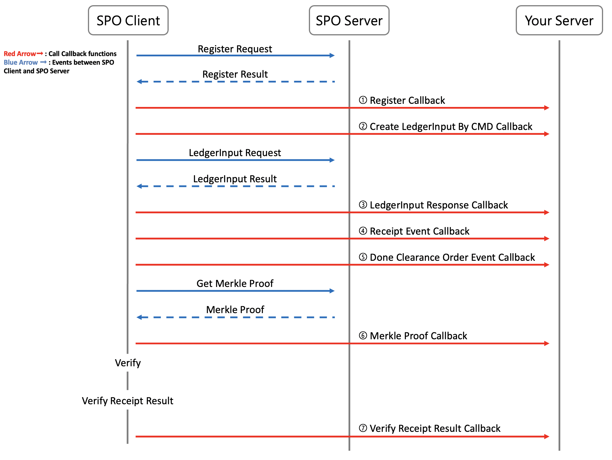
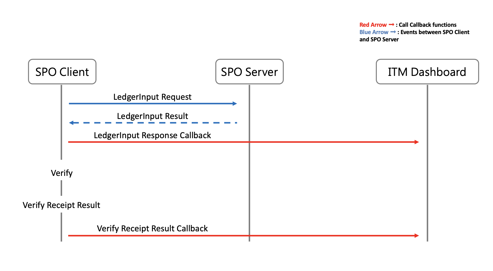
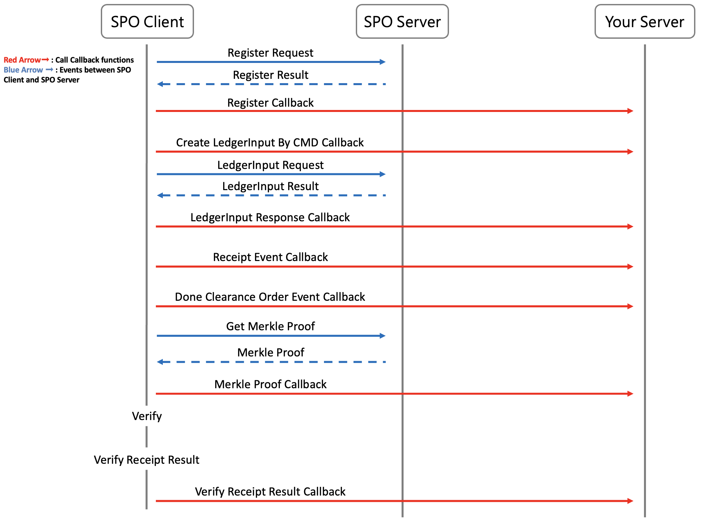

## Build the Callback Applications

### About the Callback

Callbacks send events between the BNS Client and BNS Server to BNS and your system. We define 8 events that you can Callback. We will introduce these Callbacks in the following document. The document includes two parts. The first part [(Basic)](#basic) will introduce two basic Callbacks and send events to the BNS. The second part [(Advanced)](#advanced) will introduce all Callbacks and let you integrate the Callbacks into your system, server, database, and other services.

### Prerequisites

- Complete quickstarts document
- Complete build the CMD document

### Events



1. `register_callback`: When the BNS Client is initialized, it will check the register status with the BNS Server. Developers can implement this function to call `registerRequest` and `registerResult`

2. `create_ledger_input_by_cmd_callback` :

   - After successfully initializing the BNS Client, BNS Client will store CMD and other data in `ledgerInputRequest` and do **ledgerInput** to send `ledgerInputRequest` to the BNS Server. Developers can implement this code in `create_ledger_input_by_cmd_callback` function to callback the information in `ledgerInputRequest`.
   
3. `ledger_input_response_callback` :The BNS Client will receive `ledgerInputResult` from the BNS Server after sending `ledgerInputRequest`. Developers can implement the code in `ledger_input_response_callback` function to Callback the information in `ledgerInputResult`.

4`receipt_event_callback` : The `receipt` is contained in `ledgerInputResult`. Developers can implement the code in `receipt_event_callback` function to callback the informations in `receipt`.

5`done_clearance_order_event_callback` : The `doneClearanceOrder` is contained in `ledgerInputResult`. BNS Client will use `doneClearanceOrder` to find out which receipts need to be verified. Developers can implement the code in `done_clearance_order_event_callback` function to callback the informations in `doneClearanceOrder`.

6`merkle_proof_callback` : Before verifying the receipt, BNS Client will request the `merkleProof` of the receipts to be verified from the Server. The Merkle Proof is evidence of receipt verification. The BNS Client will then use the Merkle proof to verify whether the receipt is in the TP-merkle tree or not. Developers can implement the code in `merkle_proof_callback` function to callback the informations in `merkleProof`.

7`verify_receipt_result_callback` : After receiving the Merkle Proof. The BNS Client will start to verify the receipt and store the result to `verifyReceiptResult`. Developers can implement the code in `verify_receipt_result_callback` function to callback the informations in `verifyReceiptResult`.

### Basic

We are going to use BNS as an example to demonstrate the two basic callbacks `ledger_input_response_callback` and `verify_receipt_result_callback`.

we recommand that you reference the code and document at the same time so that you can understand the callback applications better.



#### ledger_input_response_callback

- To display every `ledgerInputResult` informations on BNS, we copy `clearanceOrder` and `indexValue` from `ledgerInputResult` and paste to `receiptLocator`. These two variables is very important, we can use `clearanceOrder` and `indexValue` to calculate the location of receipt.

- Second, we call `send_ledger_input_result_to_dashboard` function to extract `status` from `ledgerInputResult` then store `receiptLocator`, `status`, and `cmdJSON` in JSON data type variable, `reqJSON`.

- Third, `send_ledger_input_result_to_dashboard` POST `reqJSON` to the BNS via `device-data-input-api`.

- For further API information, please refer to [ITM Blockchain Notary Service API Document](https://hackmd.io/ru70ReMWRESK7Ngtmr64hg)

- [callback.c](../example/bns-client-example/callback.c)
  
  ```C
  void ledger_input_response_callback(
    const receipt_locator_t *receiptLocator,
    const char *cmdJson, 
    const ledger_input_result_t *ledgerInputResult){
      ...
      ...
      // put clearanceOrder and indexValue in receiptLocator
      _receiptLocator.clearanceOrder = ledgerInputResult->receipt->clearanceOrder;
      spo_strdup(&_receiptLocator.indexValue, ledgerInputResult->receipt->indexValue);

      send_ledger_input_result_to_dashboard(&_receiptLocator, ledgerInputResult, cmdJson, &retryCount);
      ...
      ...
    }
  ```

#### verify_receipt_result_callback

- First, `verify_receipt_result_callback` call `send_verify_receipt_result_to_dashboard` to Callback the informations in the `verifyReceiptResult`

- Second, to update every verification informations on BNS, we copy `indexValue` and `clearanceOrder` from `verifyReceiptResult` and paste to JSON data type variable, `reqJSON`

- Third, we store `verifyReceiptResult` contents in `reqJSON` and POST `reqJSON` to BNS via `verify-log-api`.

- For further API information, please refer to [ITM Blockchain Notary Service API Document](https://hackmd.io/ru70ReMWRESK7Ngtmr64hg)

- [callback.c](../example/bns-client-example/callback.c)
  
  ```C
  void verify_receipt_result_callback(
    _UNUSED const receipt_t *receipt, 
    _UNUSED const merkle_proof_t *merkleProof,
    const verify_receipt_result_t *verifyReceiptResult) {
     
      LOG_DEBUG("get_verify_receipt_result() begin");
      size_t retryCount = 5;

      send_verify_receipt_result_to_dashboard(verifyReceiptResult, &retryCount);
      LOG_DEBUG("get_verify_receipt_result() end");
    }
  ```

### Advanced

Before you implement the code in Callback functions, please remember to remove the `_UNUSED` in front of the arguments



#### register_callback

**When you initialize the BNS Client, BNS Client will send `registerRequest` to BNS Server and receive `registerResult` from BNS Server. Developers can implement the code in `register_callback` function to Callback the informations in `registerRequest` and `registerResult`.**

- First, the BNS Client will call `bns_post_register` function to build `registerRequest` with `publicKey` and `walletAddres` and use `privateKey` to sign the `registerRequest` to ensure security.

- Second, BNS Client will POST `registerRequest` to BNS Server via API

- Third, BNS Client will receive the register status result from the BNS Server and `bns_post_register` will call `check_and_parse_register_reponse` to store the register status result in `registerResult`

- `registerRequest` and `registerResult` are of the struct data type. Please refer to [bns_types.h](../src/bns-client/core/bns_types.h) for more information.

- For the code of `bns_post_register`, please refer to [register.c](../src/bns-client/register/register.c)

- For further API information, please refer to [ITM Blockchain Notary Service API Document](https://hackmd.io/ru70ReMWRESK7Ngtmr64hg)

- For API URL setting, please refer to [register.h](../src/bns-client/register/register.h)

- For the code of initializing, please refer to [bns_client.c](../src/bns-client/bns_client.c)
  
  ```C
  bns_exit_code_t bns_client_init(
    bns_client_t *const bnsClient, const char *const privateKey,
    const char *const indexValueKey, const char *const serverUrl,
    const char *const nodeUrl, const receipt_dao_t *const receiptDao,
    const http_client_t *const httpClient,
    const bns_client_callback_t *const bnsClientCallback) {
      ...
      ...
      register_result_t registerResult = 0;
      if ((exitCode = bns_post_register(bnsClient, &registerResult)) != BNS_OK) {
        goto bns_client_init_fail;
      }
      ...
      ...
    }
  ```

- For the code of `bns_post_register`, please refer to [register.c](../src/bns-client/register/register.c)
  
  ```C
  bns_exit_code_t bns_post_register(
    const bns_client_t *const bnsClient,
    register_result_t *const registerResult) {
      ...
      ...
      if ((exitCode = build_register_request_with_sig(bnsClient, &registerRequest, &reqJson)) != BNS_OK) {
        goto bns_post_register_fail;
      }
      
      url = build_post_register_url(bnsClient->config.serverUrl);
      
      if (!url) {
        exitCode = BNS_POST_REGISTER_URL_NULL_ERROR;
        goto bns_post_register_fail;
      }

      res = bnsClient->httpClient.bns_post(url, reqJson);
      if (!res) {
        exitCode = BNS_POST_REGISTER_RESPONSE_NULL_ERROR;
        goto bns_post_register_fail;
      }
      BNS_FREE(reqJson);
      BNS_FREE(url);

      exitCode = check_and_parse_register_response(res, registerResult);
      
      if (exitCode != BNS_OK) {
        goto bns_post_register_fail;
      }
      
      BNS_FREE(res);
      
      if (bnsClient->bnsClientCallback.register_result) {
        bnsClient->bnsClientCallback.register_result(&registerRequest, *registerResult);
      }
      ...
      ...
    }
  ```

- For the code of `register_callback`, please refer to [callback.c](../example/bns-client-example/callback.c)

  ```C
  void register_callback(
    _UNUSED const register_request_t *registerRequest,
    _UNUSED register_result_t registerResult) {
      
      LOG_DEBUG("register_result() begin");
      /**
       * Write your code here
       */
      LOG_DEBUG("register_result() end");
    }
  ```

#### create_ledger_input_by_cmd_callback

**After successfully initializing the BNS Client, BNS Client will store CMD and other data in `ledgerInputRequest` and do ledgerInput to send `ledgerInputRequest` to the BNS Server. Developers can implement the code in `create_ledger_input_by_cmd_callback` to Callback `ledgerInputRequest`**

- BNS Client will call `build_ledger_input_request_json` to build the `ledgerInputRequest` with `cmdJSON` and sign the `ledgerInputRequest` with the `privateKey`.

- BNS Client will then call `bns_post_ledger_input` to do ledgerInput.

- After building `ledgerInputRequest`, BNS Client will POST `ledgerInputRequest` to BNS Server via the URL of BNS Server.

- `ledgerInputRequest` is a struct data type, including `timestamp`, `indexValue`, `clearanceOrder`, `cmdJson` ... and so on. Please refer to [bns_types.h](../src/bns-client/core/bns_types.h) for more information.

- In order to search ledgerInput data conveniently, we recommand that you Callback the `indexValue` and `clearanceOrder`.

- [bns_client.c](../src/bns-client/bns_client.c)
  
  ```C
  bns_exit_code_t bns_client_ledger_input(
    const bns_client_t *const bnsClient,
    const char *const cmdJson) {                          
      ...
      ...
      exitCode = bns_post_ledger_input(bnsClient, cmdJson, &receiptLocator, &ledgerInputResult);
      ...
      ...
    }
  ```

- For the code of `bns_post_ledger_input`, please refer to [ledger_input.c] [ledger_input.c](../src/bns-client/input/ledger_input.c)
  
  ```C
  bns_exit_code_t bns_post_ledger_input(
    const bns_client_t *const bnsClient, 
    const char *const cmdJson,
    const receipt_locator_t *const receiptLocator,
    ledger_input_result_t *const ledgerInputResult) {
      ...
      ...
      if ((exitCode = build_ledger_input_request_json( bnsClient, cmdJson, receiptLocator, &reqJson)) != BNS_OK) {
        goto bns_post_ledger_input_fail;
      }

      url = build_post_ledger_input_url(bnsClient->config.serverUrl);
      res = bnsClient->httpClient.bns_post(url, reqJson);
      ...
      ...
    }
  ```

- For the code of `build_ledger_input_request_json`, please refer to  [ledger_input_request.c](../src/bns-client/input/ledger_input_request.c)
  
  ```C
  bns_exit_code_t build_ledger_input_request_json(
    const bns_client_t *bnsClient, const char *cmdJson,
    const receipt_locator_t *receiptLocator, char **reqJson) {
      ...
      ...
      if ((exitCode = build_ledger_input_request(bnsClient, cmdJson, receiptLocator, &ledgerInputRequest)) != BNS_OK) {
        goto build_ledger_input_request_json_fail;
      }

      if ((exitCode = ledger_input_request_sign( &ledgerInputRequest, bnsClient->config.privateKey)) != BNS_OK) {
        goto build_ledger_input_request_json_fail;
      }

      if (bnsClient->bnsClientCallback.create_ledger_input_by_cmd) { 
        bnsClient->bnsClientCallback.create_ledger_input_by_cmd(receiptLocator, &ledgerInputRequest);
      }
      ...
      ...
    }
  ```

- For the code of `create_ledger_input_by_cmd_callback`, please refer to [callback.c](../example/bns-client-example/callback.c)

  ```C
  void create_ledger_input_by_cmd_callback(
    _UNUSED const receipt_locator_t *receiptLocator,
    _UNUSED const ledger_input_request_t *ledgerInputRequest) {
      
      LOG_DEBUG("create_ledger_input_by_cmd() begin");
      LOG_DEBUG("create_ledger_input_by_cmd() end");
    }
  ```

#### ledger_input_response_callback

**The BNS Client will receive `ledgerInputResult` from BNS Server after sending `ledgerInputRequest`. Developers can implement the code in `ledger_input_response_callback` function to callback the informations in `ledgerInputResult`**

- After receiving the result of ledgerInput, BNS Client will call `check_and_parse_ledger_input_response` function to extract the result from ledgerinput result and store the result to `ledgerInputResult`.

- For `check_and_parse_ledger_input_response`, please check [ledger_input.c](../src/bns-client/input/ledger_input.c)

- `ledgerInputResult` is a struct data type, including `stauts`, `receipt`, `doneClearanceOrder` ... and so on. Check [bns_types.h](../src/bns-client/core/bns_types.h) for more information.

- In order to search data conveniently, we recommand that you Callback the `indexValue` and `clearanceOrder`.

- [ledger_input.c](../src/bns-client/input/ledger_input.c)
  
  ```C
  bns_exit_code_t bns_post_ledger_input(
    const bns_client_t *const bnsClient, 
    const char *const cmdJson,
    const receipt_locator_t *const receiptLocator,
    ledger_input_result_t *const ledgerInputResult) {
      ...
      ...
      if ((exitCode = check_and_parse_ledger_input_response(res, ledgerInputResult)) != BNS_OK) {
        goto bns_post_ledger_input_fail;
      }
      ...
      ...
    }
  ```

- [bns_client.c](../src/bns-client/bns_client.c)
  
  ```C
  bns_exit_code_t bns_client_ledger_input(
    const bns_client_t *const bnsClient,
    const char *const cmdJson) {
      ...
      ...
      if (bnsClient->bnsClientCallback.obtain_ledger_input_response) {
        bnsClient->bnsClientCallback.obtain_ledger_input_rebnsnse(&receiptLocator, cmdJson, &ledgerInputResult);
      }
      ...
      ...
    }
  ```

- [callback.c](../example/bns-client-example/callback.c)
  
  ```C
  void ledger_input_response_callback(
    const receipt_locator_t *receiptLocator,
    const char *cmdJson, 
    const ledger_input_result_t *ledgerInputResult){
      ...
      ...
      send_ledger_input_result_to_dashboard(&_receiptLocator, ledgerInputResult, cmdJson, &retryCount);
      ...
      ...
    }
  ```

#### receipt_event_callback

**The `receipt` is contained in `ledgerInputResult`. Developers can implement the code in `receipt_event_callback` function to Callback the information in `receipt`**

- `Receipt` is a struct data type, including `timestamp`, `cmd`, `clearanceOrder` ... and so on. Check [spo_types.h](../src/bns-client/core/spo_types.h) for more information.

- In order to search data conveniently, we recommand that you Callback the `indexValue` and `clearanceOrder`.

- [spo_client.c](../src/bns-client/spo_client.c)
  
  ```C
  spo_exit_code_t spo_client_ledger_input(
    const spo_client_t *const spoClient,
    const char *const cmdJson) {
      ...
      ...
      if (spoClient->spoClientCallback.obtain_receipt_event) {
        spoClient->spoClientCallback.obtain_receipt_event(ledgerInputResult.receipt);
      }
      ...
      ...
    }
  ```

- [callback.c](../example/bns-client-example/callback.c)

  ```C
  void receipt_event_callback(
    _UNUSED const receipt_t *receipt) {
      
      LOG_DEBUG("obtain_receipt() begin");
      LOG_DEBUG("obtain_receipt() end");
    }
  ```

#### done_clearance_order_event_callback

**The `doneClearanceOrder` is contained in `ledgerInputResult`. The BNS Client will use `doneClearanceOrder` to find out which receipts need to be verified. Developers can implement the code in `done_clearance_order_event_callback` function to Callback the information in `doneClearanceOrder`**
  
- `doneClearanceOrder` is a struct data type. Check [spo_types.h](../src/bns-client/core/spo_types.h) for more informations

- [spo_client.c](../src/bns-client/spo_client.c)
  
  ```C
  spo_exit_code_t spo_client_ledger_input(
    const spo_client_t *const spoClient,
    const char *const cmdJson) {
      ...
      ...
      if (spoClient->spoClientCallback.obtain_done_clearance_order_event) {
        spoClient->spoClientCallback.obtain_done_clearance_order_event(ledgerInputResult.doneClearanceOrder);
      }
      ...
      ...
    }
  ```

- [callback.c](../example/bns-client-example/callback.c)
  
  ```C
  void done_clearance_order_event_callback(
    _UNUSED clearance_order_t doneCO) {
      LOG_DEBUG("obtain_done_clearance_order() begin");
      LOG_DEBUG("obtain_done_clearance_order() end");
    }
  ```

#### merkle_proof_callback

**Before verifying the receipt, BNS Client will request the `merkleProof` of the receipts to be verified from the Server. The merkle proof is evidence of receipt verification. BNS Client will use merkle proof to verify the receipt whether receipt is in the TP-merkle tree. Developers can implement the code in `merkle_proof_callback` function to callback the informations in `merkleProof`**

- When the BNS Client wants to verify the receipt, the BNS Client will call `verify` to obtain the merkle proof and verify the receipt.

- `verify` will call `spo_get_merkle_proof` to obtain the merkle proof from the BNS Server.

- `spo_get_merkle_proof` will call `check_and_parse_merkle_proof_response` to extract the merkle proof from the BNS Server response and store the merkle proof in `merkleProof`.

- For `verify`, please check [verify.c](../src/bns-client/verify/verify.c)
- For `spo_get_merkle_proof`, please check [merkle_proof.c](../src/bns-client/verify/merkle_proof.c)

- `merkleProof` is a struct data type, including `slice`, `pbPair`, `clearanceOrder` ... and so on. Check[spo_types.h](../src/bns-client/core/spo_types.h) for more information.

- [spo_client.c](../src/bns-client/spo_client.c)
  
  ```C
  spo_exit_code_t spo_client_verify_by_done_co(
    const spo_client_t *const spoClient, 
    const size_t verifyCount,
    const clearance_order_t doneCO) {
      ...
      ...
      spoClient->receiptDao.findPageByClearanceOrderEqualOrLessThan(doneCO, 0, count, receipt, &receiptCount);
      ...
      exitCode = verify(spoClient, &receipt[i], &merkleProof, &verifyReceiptResult);
      ...
      ...
    }
  ```

- [verify.c](../src/bns-client/verify/verify.c)
  
  ```C
  spo_exit_code_t verify(
    const spo_client_t *const spoClient,
    const receipt_t *const receipt,
    merkle_proof_t *const merkleProof,
    verify_receipt_result_t *const verifyReceiptResult) {
      ...
      ...
      exitCode = spo_get_merkle_proof(spoClient, &receiptLocator, merkleProof);
      
      if (exitCode != SPO_OK) {
        goto verify_fail;
      }
      ...
      ...
    }
  ```

- [merkle_proof.c](../src/bns-client/verify/merkle_proof.c)
  
  ```C
  spo_exit_code_t spo_get_merkle_proof(
    const spo_client_t *const spoClient,
    const receipt_locator_t *const receiptLocator,
    merkle_proof_t *const merkleProof) {
      ...
      ...
      url = build_post_merkle_proof_url(spoClient->config.serverUrl, receiptLocator);
      res = spoClient->httpClient.spo_get(url);
      exitCode = check_and_parse_merkle_proof_response(res, merkleProof);
      if (exitCode != SPO_OK) {
        goto spo_get_merkle_proof_fail;
      }
      
      SPO_FREE(res);
      
      if (spoClient->spoClientCallback.obtain_merkle_proof) {
        spoClient->spoClientCallback.obtain_merkle_proof(receiptLocator, merkleProof);
      }
      ...
      ...
    }
  ```

- [callback.c](../example/bns-client-example/callback.c)

  ```C
  void merkle_proof_callback(
    _UNUSED const receipt_locator_t *receiptLocator,
    _UNUSED const merkle_proof_t *merkleProof) {
      LOG_DEBUG("obtain_merkle_proof() begin");
      LOG_DEBUG("obtain_merkle_proof() end");
    }
  ```

#### verify_receipt_result_callback

**After receiving the Merkle Proof, the BNS Client will start to verify the receipt and store the result in `verifyReceiptResult`. Developers can implement the code in `verify_receipt_result_callback` function to Callback the information in `verifyReceiptResult`**.

- The `verify` function will call `verify_receipt_signature`, `verify_merkle_proof_signature`, `verify_clearance_order`, `verify_pb_pair`, `verify_merkle_proof_slice`, `verify_root_hash` to verify each field in the receipt and store each verification results in `verifyReceiptResult`

- `verifyReceiptResult` is a struct data type, including `indexValue`, `status`, `pass`, `timestamp` ... and so on. Check [spo_types.h](../src/bns-client/core/spo_types.h) for more information.

- For `verify`, `verify_receipt_signature`, `verify_merkle_proof_signature`, `verify_clearance_order`, `verify_pb_pair`, `verify_merkle_proof_slice`, `verify_root_hash` functions, please check [verify.c](../src/bns-client/verify/verify.c)

- To update the verification inforamtion, we recommand that you Callback the `indexValue` and `clearanceOrder`.

- [verify.c](../src/bns-client/verify/verify.c)
  
  ```C
  spo_exit_code_t verify(
    const spo_client_t *const spoClient,
    const receipt_t *const receipt,
    merkle_proof_t *const merkleProof,
    verify_receipt_result_t *const verifyReceiptResult){
      ...
      ...
      verifyReceiptResult->pass = true;
      spo_strdup(&verifyReceiptResult->status, SPO_STATUS_OK);
      spo_strdup(&verifyReceiptResult->description, SPO_STATUS_OK);
      ...
      ...
    }
  ```

- [spo_client.c](../src/bns-client/spo_client.c)

  ```C
  spo_exit_code_t spo_client_verify_by_done_co(
    const spo_client_t *const spoClient, 
    const size_t verifyCount,
    const clearance_order_t doneCO){
      ...
      ...
      if (spoClient->spoClientCallback.get_verify_receipt_result) {
        spoClient->spoClientCallback.get_verify_receipt_result(&receipt[i], &merkleProof, &verifyReceiptResult);
      }
      ...
      ...
    }
  ```

- [callback.c](../example/bns-client-example/callback.c)
  
  ```C
  void verify_receipt_result_callback(
    _UNUSED const receipt_t *receipt, 
    _UNUSED const merkle_proof_t *merkleProof,
    const verify_receipt_result_t *verifyReceiptResult) {
      
      LOG_DEBUG("get_verify_receipt_result() begin");
      size_t retryCount = 5;
      
      send_verify_receipt_result_to_dashboard(verifyReceiptResult, &retryCount);
      LOG_DEBUG("get_verify_receipt_result() end");
    }
  ```

----
Building the Callback Application document is now complete. Next, we learn how to build the ReceiptDao Application.

## Next Steps

[Build the ReceiptDao Applications](./receiptDao_en.md)
