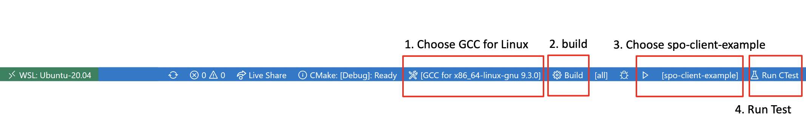

## Quick Starts

### About Quick Starts

Development for the SDK requires the following prerequisites:

- An BNS MCU SDK
- A Linux machine running with Ubuntu 18.04 / Ubuntu 20.04 / Centos 7 / Centos 8
- MacOS and Windows users can develop our SDK in Linux enviroments by using Docker, Virtual machines or other methods

Depending on your operating system, our SDK supports serveral development enviroments:

- Visual Studio Code (VSCode) : You need to install [C/C++ Extension Pack](https://marketplace.visualstudio.com/items?itemName=ms-vscode.cpptools-extension-pack) for VSCode. This extension enables you to develop and execute our SDK in Linux, MacOS, and Windows enviroments.

- Command Line Interface (CLI)

The quickstarts are intended to guide you through the steps to install the software that the SDK will need, configure the settings for Sample Code, and check the result after doing ledgerinput. The quickstarts involve the follwing steps:

<!-- no toc -->
1. [Download the SDK](#1-download-the-sdk)
2. [Install packages required to SDK](#2-install-packages-required-to-SDK)
3. [Configure setting for SDK Sample Code](#3-configure-the-settings-for-sample-code)
4. [Run the Sample code](#4-run-the-sample-code)
5. [Check the result](#5-check-the-result)

Complete the quickstart for each step, then you will be ready to run the tutorial and develop our SDK with your own application.

### 1. Download the SDK

To download the code, you will need to install git (If not installed yet) and then type

```shell
> git clone https://github.com/itrustmachines/bns-mcu-porting-kit.git
```

### 2. Install packages required to SDK

Before you run the SDK, you need to add the required Linux packages to your computer if they are not already installed. Depending on your Linix distribution, enter the following commands in the terminal. You may omit packages that are already installed but make sure your **gcc version is higher than 7.5**, you can type `gcc --version` in terminal to check.

- Check gcc Verison
  
```shell
> gcc --version
gcc (Ubuntu 9.3.0-17ubuntu1~20.04) 9.3.0
Copyright (C) 2019 Free Software Foundation, Inc.
This is free software; see the source for copying conditions.  There is NO warranty; not even for MERCHANTABILITY or FITNESS FOR A PARTICULAR PURPOSE.
```

- Ubuntu 18.04 / Ubuntu 20.04

```shell
> sudo apt install gcc g++ gdb make cmake libcurl4-openssl-dev
```

- Centos 7

```shell
> sudo yum install centos-release-scl
> sudo yum install devtoolset-9
> sudo yum install gcc-c++ gdb cmake libcurl-devel
> scl enable devtoolset-9 bash
```

- Centos 8

```shell
> sudo yum install gcc gcc-c++ gdb make cmake libcurl-devel
```

### 3. Configure the settings for Sample Code

This configuration file is very important. The main program uses this configuration file to initialize the BNS Client. The configuration file includes private key, blockchain address, server URL, setting ... etc.

- Modifying the configuration file require the following prerequisites:
  1. Private key : To make sure the reliability of every data source, we need a unique private key to process the digital signature for each data source. We recommand using [VANITY-ETH](https://vanity-eth.tk/) to generate the private key.
  
  2. Ethereum Blockchain Node URL : In order to get the onchain proof, we need to access the node on the blockchain. We use the Ethereum blockchain for our testing enviroment. The Ethereum blockchain node URL can be obtained via Infura. Please check the [Infura tutorial](infura_en.md) to get the Rinkeby Node URL.

After obtaining the private key and Ethereum Node URL, then you will be ready to modify the configuration file [config.h](../example/bns-client-example/config.h). Please check the file and follow the instructions in the file or below.

```C
/**
 * Please fill in the 128 bits (32 bytes) Hex encoded
 * private key which generated by VANITY-ETH
 */ 

#define PRIVATE_KEY "" 

/** 
 * Please fill in the index value of the data source. 
 * The index value is the index of the clearance. 
 * You can use the device ID instead, if the data source is coming from a device.
 * Ensure the index value is unique.
 */
#define INDEX_VALUE_KEY ""

/** Please fill in the EMAIL of the BNS Account */
#define EMAIL ""

/** Please fill in the URL of the BNS Server */
#define SERVER_URL "https://bns.itrustmachines.com/" 

/** 
 * Please fill in the Node URL of Rinkey which is generated by Infura
 */
#define NODE_URL "https://mainnet.infura.io/v3/{InfuraProjectId}" 
```

### 4. Run the Sample Code

#### CLI
##### make ( Only for Linux + GNU )

**There is currently no test fucntion. If you want to run the test, please check [cmake](#cmake)**

Move to the SDK directory

```shell
> make clean
> make all
```

You can use `make help` to check available options

Move to the execution file directory

```shell
> cd bin
```

Execute the sample code

```shell
> ./bns-client-example
```

The code will do ledgerinput ( send the CMD ) to the BNS Server, you can let the code keep working and go to next topic to check the result of ledgerinput. If you want to terminate, you can use `crtl + c` at any time.

##### cmake

Move to the SDK directory and create the build directory

```shell
> mkdir build
```

Move to the build directory and compile the SDK

```shell
> cd build
> cmake ..
> make
```

Run the test
```shell
> make test
```

**If you havet implicit declaration of function problems during `make`, try to build with `make C_FLAGS=-std=gnu99`**

Move to execution file directory

```shell
> cd example/bns-client-example
```

Excute the Sample code

```shell
> ./bns-client-example
```

The code will do ledgerinput ( send the CMD ) to BNS Server, you can let the code keep working and go to next topic to check the result of ledgerinput. If you want to terminate, you can use `crtl + c` at any time.

#### VSCode

1. Choose GCC for Linux
2. Build
3. Choose bns-client-example, and execute the program
4. Run test



### 5. Check the result

After executing the sample code, the BNS Client will do ledgerinput. You can login and check the result of the ledgerinput on the [Blockchain Notary Service website](https://bns.itrustmachines.com/). For instructions on BNS operations one can go to YouTube to watch the instructional [playlist](https://youtube.com/playlist?list=PL9mBKnNjNC1K0XiH9EL65QljN6Agf4k42).

----
Quickstarts is now complete. Next, learn how to build your own CMD.

## Next Steps

[Build the CMD](./cmd_en.md)
