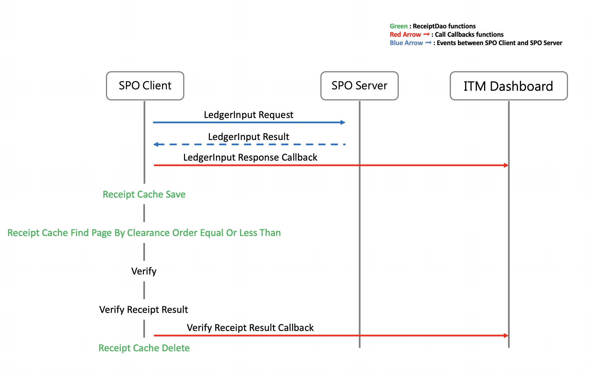

## Build the ReceiptDao Applications

### About the ReceiptDao

The ReceiptDao ( Receipt Data Access Object ) is an interface which helps developers to store, find, delete the receipt. Developers can implement the code in ReceiptDao to store the receipt in memory, databases, cloud services, or other services. In this document, we are going to store the receipt in memory as an example to guide you to understand the ReceiptDao.

### Prerequisites

- Complete the quickstarts document
- Complete the CMD document
- Complete the Callback document

### receiptDao functions



The `receiptDao` is a struct data type and includes three functions which are  

- `receipt_cache_save` : store the receipts in memory
- `receipt_cache_findPageByClearanceOrderEqualOrLessThan` : use `clearanceOrder` to find out which receipts are to be verified
- `receipt_cache_delete` : delete the verified receipts

- [bns_types.h](../src/bns-client/core/bns_types.h)

```C
typedef struct receipt_dao_t {
  void (*save)(const receipt_t *receipt);
  void (*findPageByClearanceOrderEqualOrLessThan)(
      const clearance_order_t clearanceOrder, const size_t page,
      const size_t pageSize, receipt_t *outputReceipt, size_t *outputSize);
  void (*delete)(const receipt_t *receipt);
} receipt_dao_t;
```

- [bns_client_example](../example/bns-client-example/bns_client_example.c)

```C
receipt_dao_t receiptDao = {
      .save = receipt_cache_save,
      .delete = receipt_cache_delete,
      .findPageByClearanceOrderEqualOrLessThan =
          receipt_cache_findPageByClearanceOrderEqualOrLessThan};
```

#### receipt_cache_save

- After receiving the `ledgerInputResult`, `bns_post_ledger_input` will call `receipt_cache_save` to store the receipt in memory. Developers can implement the code in `receipt_cache_save` if they want to store the receipt in other services.

- The size of `receipt` depends on `CMD` and `indexValue`. In general, the receipt is about 0.5 KB. Developers can change the maximum storage quantity of receipt depending on your system specification. Default Setting is 1000 receipts.

- For maximum storage quantity of the receipt setting, please check [receipt_dao.h](../example/bns-client-example/receipt_dao.h)

- [ledgerInput.c](../src/bns-client/input/ledger_input.c)
  
  ```C
  spo_exit_code_t spo_post_ledger_input(
    const spo_client_t *const spoClient, 
    const char *const cmdJson,
    const receipt_locator_t *const receiptLocator,
    ledger_input_result_t *const ledgerInputResult) {
      ...
      ...
      spoClient->receiptDao.save(ledgerInputResult->receipt);
      ...
      ...
    }
  ```

- [receipt_dao.c](../example/bns-client-example/receipt_dao.c)

  ```C
  static receipt_t *receiptPtr[RECEIPT_CACHE_SIZE] = {0};

  void receipt_cache_save(const receipt_t *receipt){
    
    LOG_DEBUG("receipt_cache_save() begin");

    for (int i = 0; i < RECEIPT_CACHE_SIZE; i++) {
      
      if (!receiptPtr[i]) {
        receipt_t *_receipt = (receipt_t *)malloc(sizeof(receipt_t));
        ...
        ...
        receiptPtr[i] = _receipt;
        ...
        LOG_DEBUG("receipt_cache_save() end, index=%d", i);
        return;
      }
    }
  }
  ```

- [receipt_dao.h](../example/bns-client-example/receipt_dao.h)
  
  ```C
  /* Change the maximum storage quantity here */
  #define RECEIPT_CACHE_SIZE 1000
  ```

#### receipt_cache_findPageByClearanceOrderEqualOrLessThan

- When the BNS Client wants to verify the receipt, the BNS Client will call `receipt_cache_findPageByClearanceOrderEqualOrLessThan` to use `clearanceOrder` to find out which receipts to be verified.

- If `clearanceOrder` is equal or less than the `doneClearanceOrder` of the BNS Server, the receipt will be verified by BNS Client later.

- [spo_client.c](../src/bns-client/spo_client.c)
  
  ```C
  spo_exit_code_t spo_client_verify_by_done_co(
    const spo_client_t *const spoClient, const size_t verifyCount,
    const clearance_order_t doneCO) {
      ...
      ...
      receipt = (receipt_t *)malloc(sizeof(receipt_t) * count);
      memset(receipt, 0, sizeof(receipt_t) * count);
      spoClient->receiptDao.findPageByClearanceOrderEqualOrLessThan(doneCO, 0, count, receipt, &receiptCount);
      ...
      ...
    }
  ```

- [receipt_dao.c](../example/bns-client-example/receipt_dao.c)

  ```C
  void receipt_cache_findPageByClearanceOrderEqualOrLessThan (
    const clearance_order_t clearanceOrder,
    const size_t page,
    const size_t pageSize,
    receipt_t *outputReceipt,
    size_t *outputSize){
      LOG_DEBUG("receipt_cache_findPageByClearanceOrderEqualOrLessThan() begin");
      ...
      ...
      for (i = 0; i < RECEIPT_CACHE_SIZE; i++) {
        ...
        ...
        if (receiptPtr[i]->clearanceOrder <= clearanceOrder) {
          ...
        }
        ...
        ...
      }
      ...
      LOG_DEBUG("receipt_cache_findPageByClearanceOrderEqualOrLessThan() end, ""outputSize=%ld",*outputSize);
    }
  ```

#### receipt_cache_delete

- To save the memory, the BNS Client will delete the verified receipts.

- [spo_client.c](../src/bns-client/spo_client.c)
  
  ```C
  spo_exit_code_t spo_client_verify_by_done_co(
    const spo_client_t *const spoClient, 
    const size_t verifyCount,
    const clearance_order_t doneCO) {
      ...
      ...
      spoClient->receiptDao.delete(&receipt[i]);
      ...
      ...
  }
  ```

- [receipt_dao.c](../example/bns-client-example/receipt_dao.c)

  ```C
  void receipt_cache_delete(const receipt_t *receipt){
    LOG_DEBUG("receipt_cache_delete() begin");
    ...
    ...
    LOG_DEBUG("receipt_cache_delete() end");
  }
  ```

----
Build the ReceiptDao Application document is now complete. Next, we learn how to configure the remaining setting of BNS Client.

## Next Steps

[Configure the Setting of BNS Client](./other_setting_en.md)
