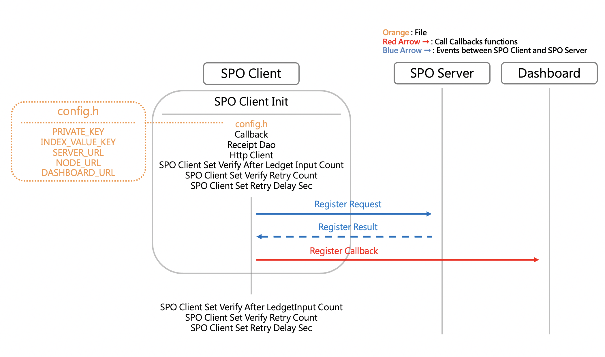
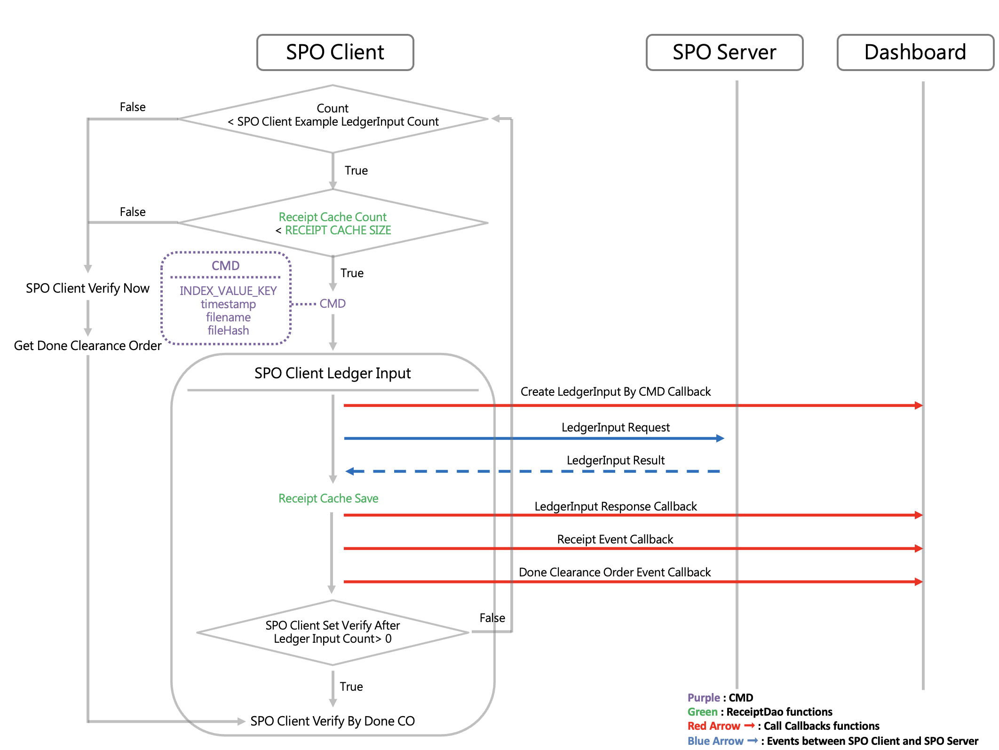
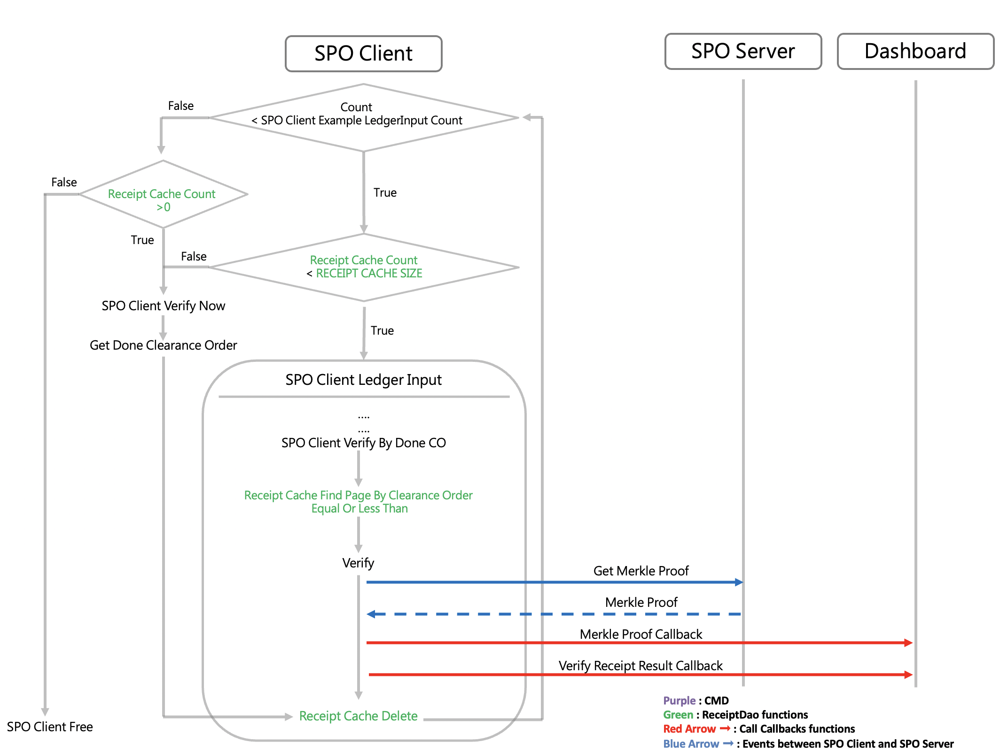

## Overview of BNS Client

### About the overview of BNS Client

If you want to explore our SDK in more details or modify our SDK, we recommand you go through this document. In this document, we will combine the previous tutorials and settings to guide you through the operation of BNS Client.

### Prerequisites

- Complete the quickstarts document
- Complete the CMD document
- Complete the Callback document
- Complete the ReceiptDao document
- Complete the other setting documents

### Callback Applications

- BNS Client initialize the `bnsClientCallback` struct with each callback function. Check [Build the Callback Applications](./callback_en.md) for more informations
  
  ```C
  bns_client_callback_t bnsClientCallback = 
  {
      .register_callback = register_callback,
      .create_ledger_input_by_cmd = create_ledger_input_by_cmd_callback,
      .obtain_ledger_input_rebnsnse = ledger_input_response_callback,
      .obtain_binary_ledger_input_response = binary_ledger_input_response_callback,
      .obtain_receipt_event = receipt_event_callback,
      .obtain_done_clearance_order_event = done_clearance_order_event_callback,
      .obtain_merkle_proof = merkle_proof_callback,
      .get_verify_receipt_result = verify_receipt_result_callback
  };
  ```

### ReceiptDao Applications

- BNS Client initialize the `receiptDao` struct with each receiptDao function. Check [Build thte ReceiptDao Applications](receiptDao_en.md) for more informations

  ```C
  receipt_dao_t receiptDao = 
  {
      .save = receipt_cache_save,
      .delete = receipt_cache_delete,
      .findPageByClearanceOrderEqualOrLessThan = receipt_cache_findPageByClearanceOrderEqualOrLessThan
  };
  ```

### HttpClient Applications

- BNS Client initialize `httpClient` struct with each httpClient function. Check [ssl_get.c](../example/bns-client-example/ssl_get.c) and [ssl_get.h](../example/bns-client-example/ssl_get.h) for more httpClient information

  ```C
  http_client_t httpClient = 
  {
      .bns_get = bns_get, 
      .bns_post = spo_post, 
      .eth_post = eth_post
  };
  ```

### Initialize BNS Client



- To estabish the ledgerInput and Verification service with BNS Server, BNS Client will call `spo_client_init` function to initialize the Callback, ReceiptDao, HttpClient, and configuration file

- When initializing the BNS Client, BNS Client will register with BNS Server and call the `register_callback`. Developers can implement the code in `register_callback` to callback the informations in `registerRequest` and `registerResponse`
  
- The settings of `PRIVATE_KEY`、`INDEX_VALUE_KEY`、`SERVER_URL`、`NODE_URL`. Please check [Configure setting for SDK Sample Code](./quick_start_en.md)

  ```C
  spo_client_t spoClient = {0};
  if ((spoExitCode = spo_client_init(
    &spoClient, PRIVATE_KEY, INDEX_VALUE_KEY, SERVER_URL, NODE_URL,
    &receiptDao, &httpClient, &spoClientCallback)) != BNS_OK) {
      goto spo_client_example_fail;
  }
  
  ```

- After initializing, BNS Client will call the `spo_client_set_verify_after_ledger_input_count`, `spo_client_set_retry_count` and `spo_client_set_retry_delay_sec` to update the setting. Check [other setting](./other_setting_en.md) for more informations

  - `spo_client_set_verify_after_ledger_input_count` : set the number of receipts to be verified after each ledgerInput

  - `spo_client_set_retry_count` : set the maximum retry count after failed ledgerInput
  - `spo_client_set_retry_delay_sec` : set the delay time for each retry

  ```C
  if ((spoExitCode = spo_client_set_verify_after_ledger_input_count( &spoClient, 2)) != BNS_OK) {
    goto spo_client_example_fail;
  }

  if ((spoExitCode = spo_client_set_retry_count(&spoClient, 5)) != BNS_OK) {
    goto spo_client_example_fail;
  }

  if ((spoExitCode = spo_client_set_retry_delay_sec(&spoClient, 5)) != BNS_OK) {
    goto spo_client_example_fail;
  }
  ```

### LedgerInput



- After successfully initializing the BNS Client, BNS Client will convert `CMD` to JSON data type, `cmdJSON`, and call `spo_client_ledger_input` function to do the ledgerInput. Check [Build the CMD](./cmd_en.md) for more informations

- `spo_client_ledger_input` will store `cmdJSON` and other informations in `ledgerInputRequest` then call `create_ledger_input_by_cmd_callback` to callback the informations in `ledgerInputRequest`

- After building the `ledgerInputRequest`, BNS Client will send `ledgerInputRequest` to BNS Server, then receive the `ledgerInputResponse` from BNS Server and call `receipt_cache_save` to save the receipt

- BNS Client will call `ledger_input_response_callback`, `receipt_event_callback` and  `done_clearance_order_event_callback` to callback the informations in `ledgerInputResponse`, `receipt` and `doneClearanceOrder`. The `receipt` and `doneClearanceOrder` are contained in `ledgerInputResponse`.

- BNS Client will check the setting of `spo_client_set_verify_after_ledger_input_count` whether it is greater than 0. If true, BNS Client will call `spo_client_verify_by_done_co` to verify the receipt, otherwise, BNS Client will keep doing ledgerInput until `receipt_cache_size` is full. Then BNS Client will call `spo_client_verify_now` to verify the receipt, you can change the value of `spo_client_verify_now` to configure how many receipt will be verified.

### Verify



- `spo_client_verify_by_done_co` will call `receipt_cache_findPageByClearanceOrderEqualOrLessThan` function to use `clearanceOrder` to find out which receipts to be verified. If `clearanceOrder` is equal or less than the `doneClearanceOrder` of the BNS Server, the receipt will be verified by BNS Client later

- BNS Client call `spo_get_merkle_proof` to request the merkleProof of the receipts from the BNS Server.

- After obtaining the merkleProof, BNS Client will call the `merkle_proof_callback` to callback the informations in `merkleProof` and call `verify` function to verify the receipt.

- `spo_client_verify_now` will call `spo_get_done_clearanceOrder` first to request the latest `doneClearanceOrder` from the BNS Server and then call `spo_client_verify_by_done_co` to verify the receipt

- After verifying the receipt, BNS Client will call `verify_receipt_result_callback` to callback the informations in `verifyReceiptResult`

  ```C
  size_t count = 0;

  while (count < SPO_CLIENT_EXAMPLE_LEDGER_INPUT_COUNT) {
    if (receipt_cache_count() < RECEIPT_CACHE_SIZE) {

      char cmdJson[CMD_LEN] = {0};
      char *timestamp = get_timestamp_string();

      sprintf(cmdJson, "{\"deviceId\":\"%s\",\"timestamp\":%s}", INDEX_VALUE_KEY, timestamp);
      SPO_FREE(timestamp);

      if ((spoExitCode = spo_client_ledger_input(&spoClient, cmdJson)) != SPO_OK) {
        goto spo_client_example_fail;
      }
      count++;
    } else {

      if ((spoExitCode = spo_client_verify_now(&spoClient, 5)) != SPO_OK) {
        goto spo_client_example_fail;
      }
      nanosleep((const struct timespec[]){{1L, 0L}}, NULL);
    }
  }
  while (receipt_cache_count() != 0) {
    if ((spoExitCode = spo_client_verify_now(&spoClient, 5)) != SPO_OK) {
      goto spo_client_example_fail;
    }
    LOG_INFO("spo_client_example() wait");
    nanosleep((const struct timespec[]){{1L, 0L}}, NULL);
  }
  ```

----

The User Guide is now complete. If you have any problem about our SDK, please feel free to contact us.

[Home](../README.md)
